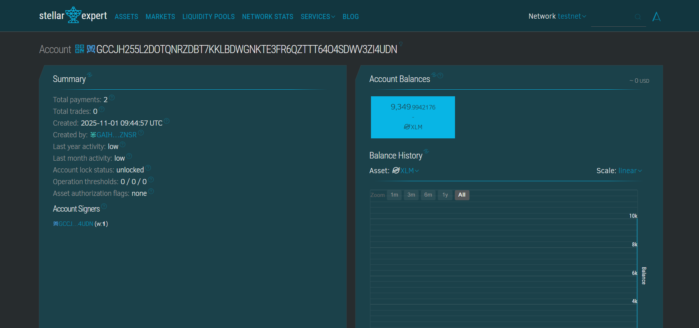

# Decentralized Scholarship Distribution System

## Table of Contents
- [Project Title](#project-title)
- [Project Description](#project-description)
- [Project Vision](#project-vision)
- [Key Features](#key-features)
- [Future Scope](#future-scope)
- [Contract ID](#Contract-ID)

---

## Project Title

**Decentralized Scholarship Distribution System**

A decentralized scholarship management and distribution system built on the Stellar blockchain network, enabling transparent, secure, and automated scholarship payments to students worldwide.

---

## Project Description

The Decentralized Scholarship Distribution System is a revolutionary blockchain-based solution designed to modernize scholarship management and distribution processes. Built on the Stellar network, this system facilitates direct, transparent, and immutable scholarship transactions between educational institutions, donors, and students.

The contract serves as the backbone of a comprehensive scholarship ecosystem that eliminates traditional intermediaries, reduces administrative overhead, and ensures that scholarship funds reach deserving students efficiently. By leveraging Stellar's fast, low-cost transaction capabilities, the system makes scholarship distribution accessible globally, particularly benefiting students in underserved regions.

### Core Functionality

The smart contract manages the entire scholarship lifecycle from application approval to fund disbursement. It maintains comprehensive records of all scholarship transactions, student profiles, and institutional statistics while ensuring data integrity through blockchain immutability. The system supports multiple scholarship programs simultaneously and provides real-time tracking of fund distribution.

### Technical Architecture

Built using Rust and Soroban SDK, the contract follows Stellar's best practices for smart contract development. It implements efficient storage patterns, secure access controls, and optimized gas consumption to ensure cost-effective operations at scale.

## Project Vision

Our vision is to create a **global, borderless scholarship ecosystem** that democratizes access to education funding through blockchain technology. We envision a future where:

### 🌍 **Global Accessibility**
Breaking down geographical barriers to scholarship opportunities, enabling students from any corner of the world to access educational funding without traditional banking limitations or cross-border transaction complexities.

### � **Transparency & Trust**
Establishing unprecedented transparency in scholarship distribution through immutable blockchain records, allowing donors, institutions, and students to track every transaction and ensuring accountability at every level.

### ⚡ **Instant Distribution**
Revolutionizing the traditional scholarship disbursement process by enabling real-time payments that can reach students within seconds rather than weeks or months through conventional banking systems.

### 🤝 **Inclusive Education**
Fostering educational inclusivity by removing financial and geographical barriers, particularly supporting students in developing regions who face challenges accessing traditional banking services.

### 📊 **Data-Driven Insights**
Providing institutions and donors with comprehensive analytics and reporting capabilities to measure the impact of their scholarship programs and optimize future funding strategies.

### 🔄 **Sustainable Ecosystem**
Creating a self-sustaining platform where reduced administrative costs and increased efficiency enable more funds to reach students while encouraging greater participation from donors and institutions.

---

## Key Features

### 🛡️ **Secure Fund Management**
- **Multi-signature Security**: Advanced cryptographic security ensuring only authorized personnel can distribute scholarships
- **Immutable Records**: All transactions permanently recorded on the Stellar blockchain for complete audit trails
- **Access Control**: Role-based permissions ensuring only administrators can release funds while maintaining transparency
- **Admin-only Distribution**: Contract functions restricted to verified administrator addresses with proper authentication

### 📈 **Comprehensive Analytics**
- **Real-time Statistics**: Live tracking of total disbursements, student counts, and scholarship distribution metrics
- **Student Profiles**: Detailed records of individual student scholarship history and achievements
- **Performance Metrics**: Contract-level statistics for monitoring system efficiency and impact measurement
- **Activity Tracking**: Comprehensive logging of all contract interactions and state changes

### 💳 **Advanced Smart Contract Functions**
- **`init(admin)`**: One-time contract initialization with administrator setup
- **`release_scholarship(student, amount, scholarship_id)`**: Secure scholarship distribution to verified students
- **`get_student_profile(student)`**: Retrieve comprehensive student scholarship history
- **`get_contract_stats()`**: Access real-time contract performance and distribution statistics
- **`update_admin(new_admin)`**: Secure administrator role transfer functionality

### 🌐 **Blockchain Integration**
- **Stellar Network**: Built on Stellar's fast, low-cost, and environmentally friendly blockchain
- **WASM Optimization**: Compiled to WebAssembly for optimal performance and cross-platform compatibility
- **Soroban SDK**: Leveraging Stellar's advanced smart contract framework for reliability and security
- **Storage Efficiency**: Optimized storage patterns using instance, persistent, and temporary storage tiers

### 🔍 **Transparency & Verification**
- **Public Verification**: Anyone can verify scholarship distributions through Stellar blockchain explorers
- **Immutable Audit Trails**: Complete transaction history that cannot be altered or deleted
- **Real-time Monitoring**: Live tracking of all contract activities and fund movements
- **Cross-platform Access**: Compatible with web browsers, mobile apps, and desktop applications

### ⚡ **Performance & Scalability**
- **Low Transaction Costs**: Minimal fees for global scholarship distribution
- **Fast Settlement**: Near-instantaneous transaction confirmation for immediate fund availability
- **High Throughput**: Capable of handling multiple concurrent scholarship distributions
- **Gas Optimization**: Efficient smart contract design minimizing computational costs

---

## Future Scope

### 🚀 **Immediate Enhancements (6-12 months)**

#### **Advanced Smart Contract Features**
- **Conditional Payments**: Implementation of milestone-based scholarship releases tied to academic performance metrics
- **Multi-institutional Support**: Expansion to support multiple educational institutions within a single contract instance
- **Automated Compliance**: Built-in regulatory compliance checks and automated reporting functionality
- **Batch Processing**: Enhanced batch operations for processing hundreds of scholarships simultaneously

#### **Enhanced Security & Governance**
- **Multi-signature Admin**: Multiple administrator approval requirements for large scholarship distributions
- **Time-locked Releases**: Scheduled scholarship payments with predetermined release dates
- **Emergency Controls**: Admin pause functionality for emergency situations or security concerns
- **Governance Tokens**: Community-driven decision making for scholarship criteria and distribution policies

### 🌟 **Medium-term Goals (1-2 years)**

#### **Ecosystem Expansion**
- **Cross-chain Compatibility**: Extension to Ethereum, Polygon, and other major blockchain networks
- **DeFi Integration**: Connection with decentralized finance protocols for yield generation on scholarship pools
- **NFT Credentials**: Blockchain-based educational certificates and achievement tokens for scholarship recipients
- **Oracle Integration**: Real-world data feeds for academic performance verification and automated distributions

#### **Advanced Analytics & AI**
- **Machine Learning Integration**: AI-powered fraud detection and scholarship recipient recommendation algorithms
- **Predictive Analytics**: Student success prediction models for optimized scholarship allocation strategies
- **Impact Measurement**: Comprehensive tracking of educational outcomes and long-term career progression
- **Performance Benchmarking**: Institutional performance comparison and best practice identification

#### **Platform Development**
- **Mobile SDK**: Native mobile application development kit for iOS and Android integration
- **API Gateway**: RESTful API services for seamless integration with existing educational management systems
- **White-label Solutions**: Customizable contract deployments for individual institutions and organizations
- **Multi-language Support**: Internationalization for global accessibility in 25+ languages

### 🔮 **Long-term Vision (3-5 years)**

#### **Global Education Infrastructure**
- **Decentralized Education DAO**: Community-governed autonomous organization for global education funding
- **Universal Basic Education**: Blockchain-based universal access to educational resources and funding
- **Micro-learning Rewards**: Tokenized incentives for continuous learning and professional skill development
- **Educational Metaverse**: Virtual reality educational environments with integrated blockchain payment systems

#### **Advanced Blockchain Features**
- **Zero-Knowledge Privacy**: Enhanced privacy features using zk-SNARKs while maintaining transaction transparency
- **Quantum-Resistant Security**: Implementation of post-quantum cryptography for future-proof security
- **Layer 2 Scaling**: Advanced scaling solutions for millions of daily scholarship transactions
- **Interplanetary Network**: Preparation for space-based educational initiatives and off-world scholarship programs

#### **Social Impact Initiatives**
- **Climate-conscious Operations**: Carbon-neutral blockchain operations with environmental impact offset tracking
- **Refugee Education Support**: Specialized emergency scholarship programs for displaced populations
- **Rural Connectivity Programs**: Satellite-based blockchain solutions for remote area educational access
- **Poverty Alleviation**: Targeted scholarship programs for breaking intergenerational poverty cycles

### 🔬 **Research & Development**

#### **Emerging Technologies**
- **Artificial General Intelligence**: Advanced AI tutors and personalized learning path optimization
- **Brain-Computer Interfaces**: Direct neural interfaces for enhanced learning experiences
- **Quantum Computing**: Quantum algorithms for complex educational matching and optimization problems
- **Biotechnology Integration**: Personalized learning based on genetic predispositions and cognitive abilities

#### **Regulatory & Compliance Innovation**
- **Global Regulatory Framework**: Development of international standards for blockchain-based education funding
- **Central Bank Digital Currency Integration**: Compatibility with national digital currencies and CBDCs
- **Automated Tax Compliance**: Smart contract integration with national tax systems for automatic reporting
- **International Education Treaties**: Blockchain-backed international agreements for cross-border education funding

---

## Contract ID
GCCJH255L2DOTQNRZDBT7KKLBDWGNKTE3FR6QZTTT64O4SDWV3ZI4UDN

